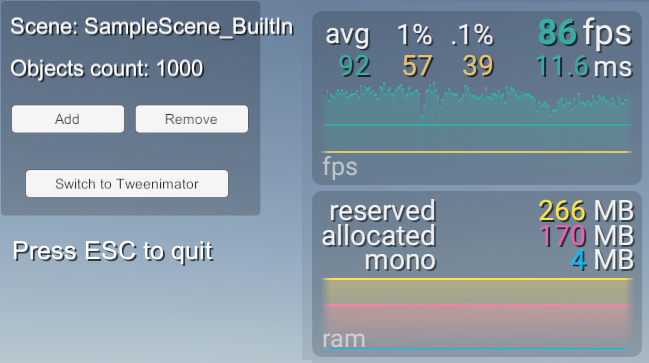
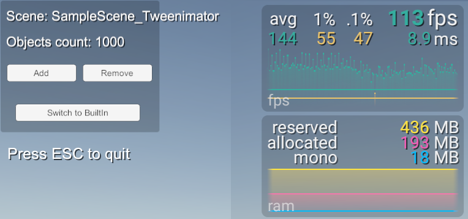
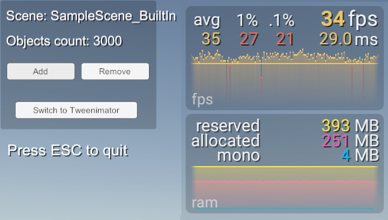
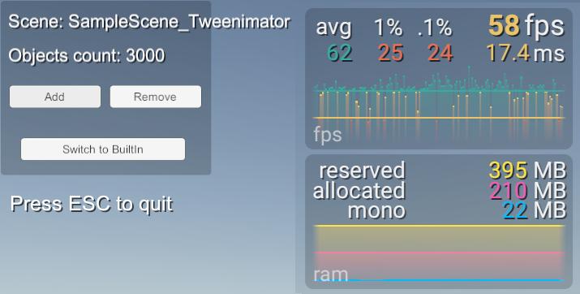
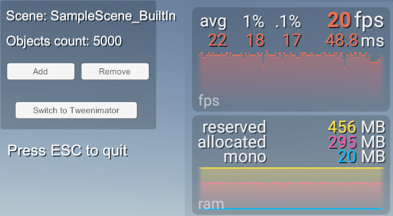
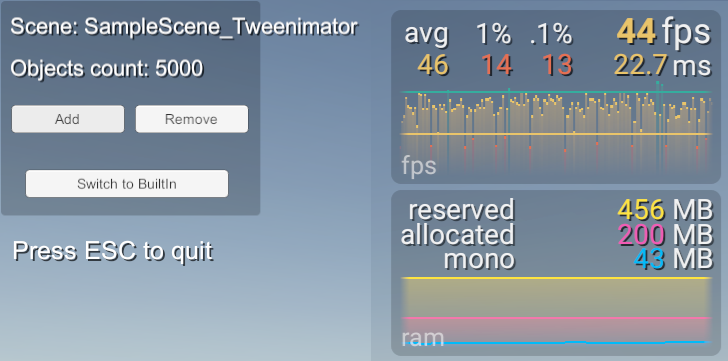

# Tweenimator


**Tweenimator** is a Unity package that converts standard Unity animations to highly optimized tween-based animations using [LitMotion](https://github.com/annulusgames/LitMotion). It provides tools for converting and editing animations, with name-based search and caching for flexible object reassignment.

## Features

- **Convert Standard Animations to Tweens**: Easy convert Unity Animation clips to optimized tween-based animations
- **High Performance**: Uses LitMotion for efficient, zero-allocation tweening
- **Name-Based Target Search**: Animations use path-based target lookup, allowing easy reassignment to different objects with matching hierarchy structures
- **Editor Integration**: Custom editor with validation and preview tools
- **Async Support**: Built on UniTask for async/await pattern support
- **Flexible Reset Options**: Configure behavior on animation cancel (None, ResetToStart, ResetToEnd)

## Supported Animations

Tweenimator currently supports conversion of the following animation types:

| Property | Target Type | Binding Type |
|----------|-------------|--------------|
| Local Position | Transform | LocalPosition |
| Local Rotation | Transform | LocalRotation |
| Local Scale | Transform | LocalScale |
| Anchored Position | RectTransform | AnchoredPosition |
| Size Delta | RectTransform | SizeDelta |
| Graphic Color | Graphic | GraphicColor |
| Canvas Group Alpha | CanvasGroup | CanvasGroupAlpha |
| Pixels Per Unit | Image | PixelsPerUnit |
| GameObject Activity | GameObject | GameObjectActivity |
| Component Activity | Behaviour | ComponentActivity |

## Dependencies

- [LitMotion](https://github.com/annulusgames/LitMotion) - High-performance tweening library
- [UniTask](https://github.com/Cysharp/UniTask) - Async/await support for Unity
- Unity 2022.3 or later

## Installation

1. Open Unity Package Manager (Window > Package Manager)
2. Click the `+` button and select "Add package from git URL"
3. Enter the repository URL

Or add to `manifest.json`:
```
{
  "dependencies": {
    ...
    "com.AlexanderKotof.tweenimator": "https://github.com/AlexanderKotof/tweenimator.git",
    ...
  }
}
```

## Usage

### Converting Animations

1. Select an object with an Animator, Animation clips, or Animation Controller in the Hierarchy
2. Go to **Tools > Tweenimator > Convert Selected Animations**
3. Tweenimator will create `.asset` files for each animation clip found and add them to a `TweenAnimationsComponent` (if a gameobject with Animator selected)

### Playing Animations

1. For easy testing and to start with use the [`TweenAnimationsComponent`](Assets/Tweenimator/Runtime/Components/TweenAnimationsComponent.cs).
2. Assign the converted animation clips to the component's Animations list
3. Call [`PlayAnimation()`](Assets/Tweenimator/Runtime/Components/TweenAnimationsComponent.cs:29) to play:
*Note: if you change some properties in animation asset like add new targets or change targets paths it will required to update cached targets in component. Press Validate button for this.

```csharp
public class Example : MonoBehaviour
{
    [SerializeField] private TweenAnimationsComponent _tweenAnimations;
    
    void Start()
    {
        // Play first animation
        _tweenAnimations.PlayAnimation(0);
        
        // Play specific animation by index
        _tweenAnimations.PlayAnimation(1);
    }
}
```

### Name-Based Target Reassignment

Tweenimator uses name-based path search for animation targets,  This means you can:

1. Create an animation on one object
2. Reassign it to a different object with the same hierarchy structure
***Note: use empty MainTarget
3. Press **Validate** in the inspector to re-register targets

Example hierarchy:
```
Character
├── Head (has Image component)
├── Body (has RectTransform)
└── Arm
    └── Hand (has CanvasGroup)
```

An animation targeting `Head/Image` or `Body/RectTransform` can be moved to any other object with the same structure.

## Editor Tools

### AnimationToTwinConverter

The main conversion tool with menu options:

- **Tools > Tweenimator > Convert Selected Animations**: Convert animations from selected objects

## Performance

Tweenimator uses LitMotion's high-performance tweening system with:

- Zero heap allocations during playback
- Efficient motion storage and dispatch
- Optimized for thousands of simultaneous animations

### Built-In comparison

See the [Examples](Assets/Examples/) folder for performance comparison with Unity's built-in Animator.

| Built-In Animator | Tweenimator |
|-------------------|-------------------|
| 1000 obj | 1000 obj |
| 3000 obj | 3000 obj |
| 5000 obj | 5000 obj |

## Examples

The package includes example scenes demonstrating common functionality and comparison between Built-in and Tweenimator:

- [`SampleScene_Tweenimator`](Assets/Examples/Scenes/SampleScene_Tweenimator.unity): Tweenimator-based animations
- [`SampleScene_BuiltIn`](Assets/Examples/Scenes/SampleScene_BuiltIn.unity): Built-in Animator comparison

## License

This package is licensed under the MIT License. See the [LICENSE](LICENSE) file for details.

## Acknowledgments

- [LitMotion](https://github.com/annulusgames/LitMotion) for the high-performance motion library
- [UniTask](https://github.com/Cysharp/UniTask) for async/await support